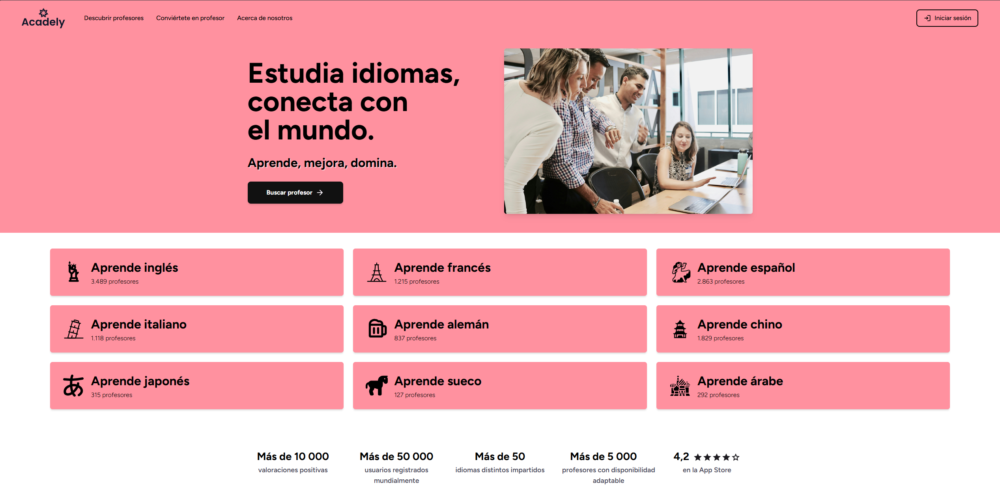

# Acadely - Fully Responsive Homepage Mockup

<p align="center">
  
</p>

<p align="center">
   
   
</p>

A fully responsive homepage mockup for the Acadely project. Made with HTML5, CSS3, Tailwind CSS, and JavaScript.

---

## Getting started

Since Tailwind CSS is involved, it is crucial to follow the steps below in order to see the actual changes take effect.

### 1. Clone the repository

### 2. Install dependencies

Make sure you have installed Node.js and npm, otherwise it won't work.

```bash
npm install
```

### 3. Start development server

```bash
npm run dev
```
